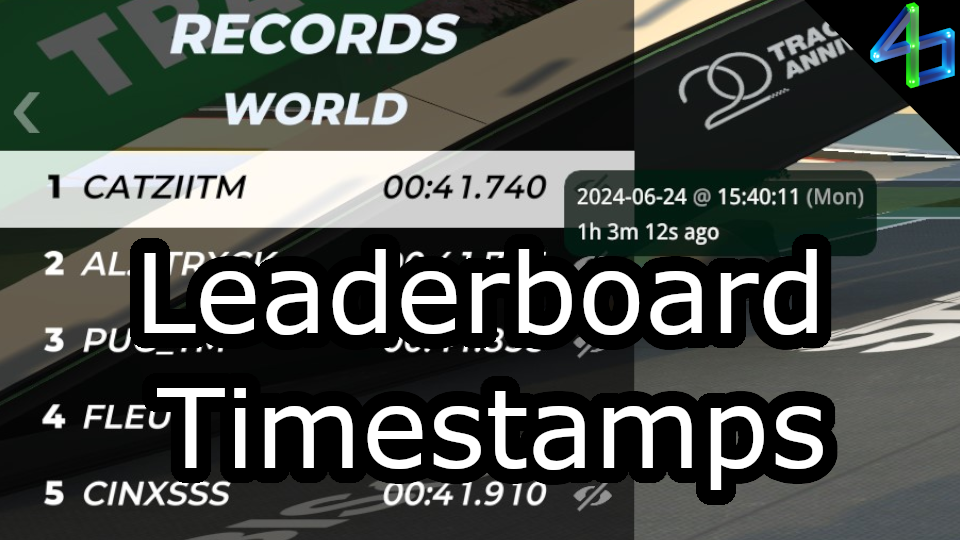

# Leaderboard Timestamps

Shows a timestamp on the in-game records panel when you hover over someone's name. Works for all regions, your pinned club, club VIPs, and other VIPs (though I'm not sure what these actually are).

Automatically refreshes when:
- entering a map
- a new PB is set
- the records panel is refreshed (i.e. with the [Refresh Leaderboards](https://openplanet.dev/plugin/refreshleaderboard) plugin)

There are also settings available to customize how the displayed tooltip appears.

Known issues:
- If someone is knocked off of the records panel (someone else drove a better time than them) and this plugin is refreshed without the records panel being refreshed, their timestamp will no longer be shown.
- If your pinned club has many VIPS (like 180+) then a request will probably fail.

<!--  -->
<!--  -->
<!--  -->
<!--  -->
<!--  -->
<!--  -->

